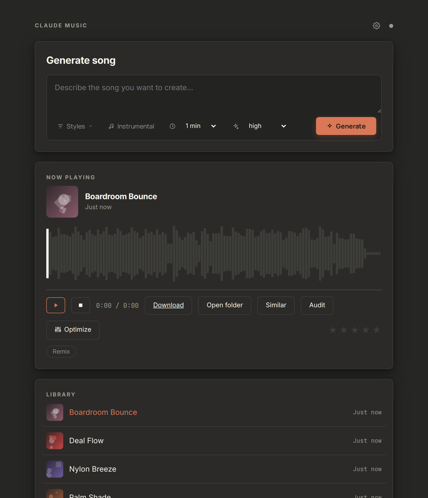
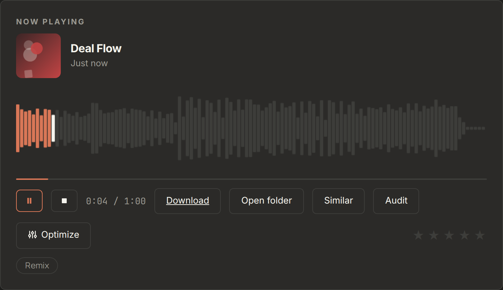
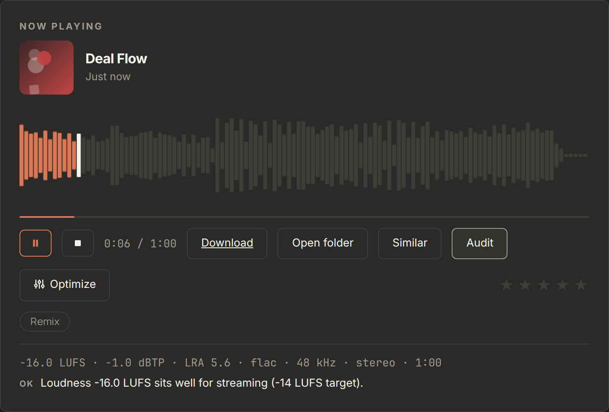
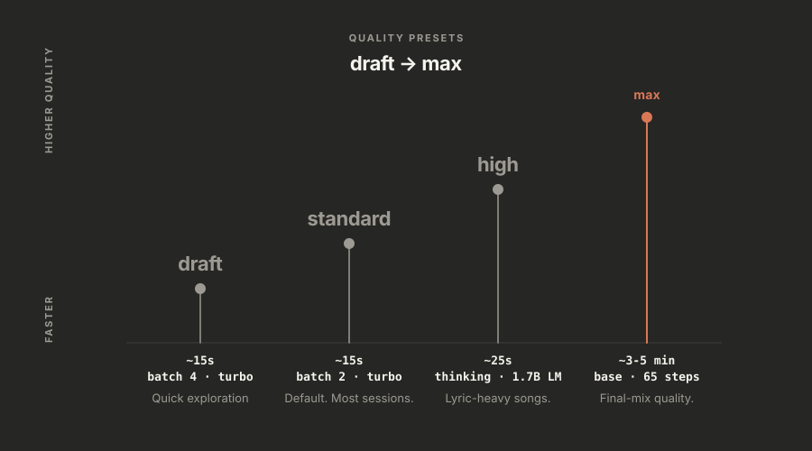
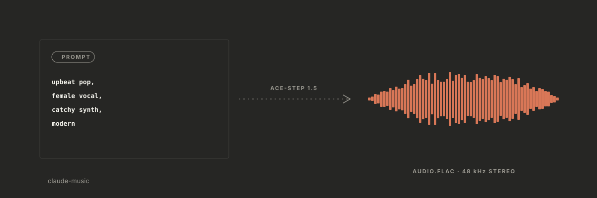
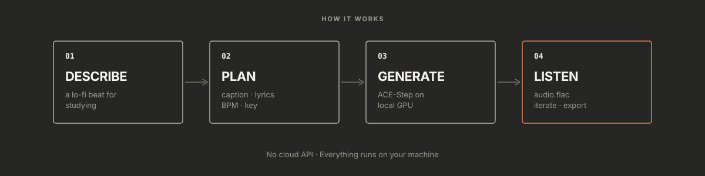
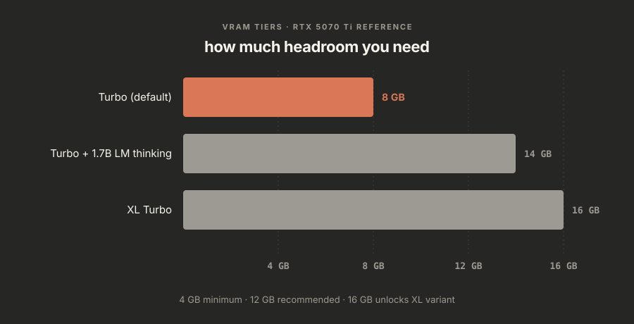
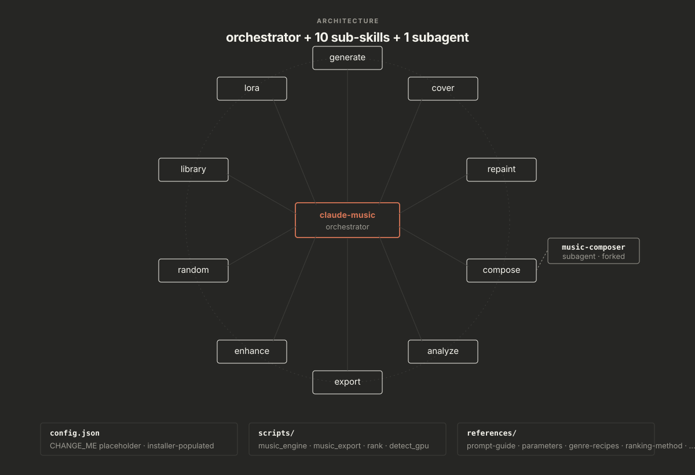
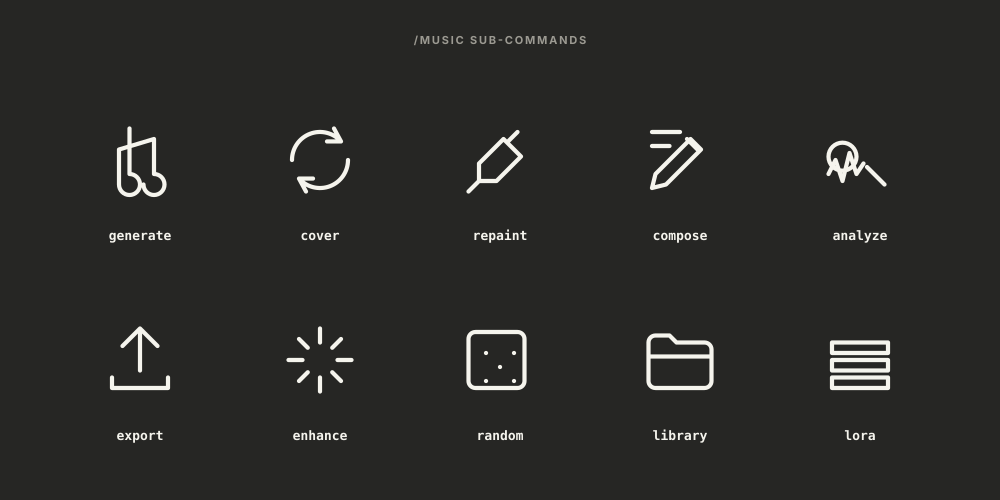

<p align="center">
  
</p>

# claude-music

Make full songs on your own computer by describing them in plain words.

claude-music turns [Claude Code](https://claude.ai/code) into a music studio,
powered by [ACE-Step 1.5](https://github.com/ace-step/ACE-Step-1.5). Type
"make me a chill lo-fi beat" and get a finished track in about 15 seconds.
No cloud, no subscription, no per-song fees. Your GPU does the work.

<p align="center">
  
</p>

## Hear It

Four unedited songs it made, exactly as they came out. All four are about
the same subject (an SEO tool), with full sung lyrics written by Claude
and vocals in three languages:

| Track | Style and voice |
|-------|-----------------|
| [Crawl Season](examples/crawl-season.mp3) | Hip-hop, English rap: "Ran one little audit, now the crawlers all obsessed" |
| [SEO Caliente](examples/seo-caliente.mp3) | Latin pop / reggaeton, Spanish vocals |
| [Tokyo Page One](examples/tokyo-page-one.mp3) | Japanese lo-fi / city pop, Japanese vocals |
| [First Page Swing](examples/first-page-swing.mp3) | Jazz crooner with a piano trio |

## Get Started (5 minutes)

One command installs everything:

```bash
git clone https://github.com/AgriciDaniel/claude-music.git
cd claude-music
bash install.sh
```

Windows (PowerShell): `powershell -ExecutionPolicy Bypass -File .\install.ps1`

The installer checks your system, sets up ACE-Step and the models (~5GB,
asks first), and links everything to Claude Code. Then open Claude Code and
say:

> "Generate a chill lo-fi beat, 60 seconds"

Or open the dashboard in your browser:

```
/music web
```

## What You Can Do

| Say this... | What happens |
|-------------|--------------|
| "Make me a song about..." | A full song with vocals |
| "Create an instrumental jazz piece" | Instrumental track |
| "Make a rock cover of this song" | Your song, remade in a new style |
| "Fix the chorus, make it more energetic" | Edits just that section |
| "Export for Spotify" | Loudness-ready file for the platform |
| "Surprise me" | Random genre, instant song |

## The Dashboard

Everything in one page, running privately on your machine:

- Describe a song, pick styles, press Generate, watch the live progress
- A real waveform player: click anywhere to jump, bars move with the beat
- Your library with album art, titles you can rename, and star ratings
- Drag and drop your own songs to check their loudness, fix them for
  streaming, or generate similar tracks from them

<p align="center">
  
</p>
<p align="center">
  
</p>

## What You Need

- [Claude Code](https://claude.ai/code) (free CLI, desktop app, or VS Code)
- An NVIDIA GPU with 4GB+ VRAM (8GB+ recommended; CPU works but is slow)
- ~10GB of disk space

The installer handles the rest (Python, FFmpeg, uv, ACE-Step).

## Quality Presets

| Preset | Speed | Best for |
|--------|-------|----------|
| `draft` | ~15s | Quick ideas (4 variants) |
| `standard` | ~15s | Everyday use (2 variants) |
| `high` | ~25s | Better lyrics and structure |
| `max` | ~3-5min | Highest quality possible |

<details>
<summary><b>Changing defaults, file naming, and settings precedence</b></summary>

<p align="center">
  
</p>

`standard` skips the 1.7B LM thinking pass that plans BPM, key and structure
before diffusion, which is why it can produce thinner melodies than `high`.

Settings resolve in this order: **CLI flag > `config.json` > quality preset.**
To stop passing `--quality high` on every run, set it once in
`skills/claude-music/config.json`:

```json
{
  "defaults": {
    "quality": "high",
    "format": "flac"
  }
}
```

`quality`, `format`, `language` and the memory settings
(`offload_to_cpu`, `offload_dit_to_cpu`, `use_flash_attention`) are read from
there, as is the top-level `output_dir` (also changeable from the dashboard's
Settings gear).

`model`, `lm_model`, `batch_size` and `thinking` are owned by the quality
preset and are deliberately absent from the shipped config. Adding one pins it
across *every* preset, e.g. a `batch_size` of 2 would silently defeat
`draft`'s 4.

**Output file naming**: files are renamed from raw UUIDs to something
readable:

```
lo-fi-afro-latin-percussion-nylon_20260812-1548_01_s3128607774.flac
```

The seed at the end lets you regenerate or vary a track you liked
(`--seed 3128607774`). Renaming never overwrites; collisions get a `-2`
suffix. Set `"naming": "uuid"` to keep the original names.

</details>

## All Commands

```
/music generate   - Create music from text + lyrics
/music cover      - Remake a song in a different style
/music repaint    - Edit a section of a song
/music compose    - Songwriting help (lyrics, caption, BPM)
/music export     - Export for Spotify/YouTube/TikTok/etc
/music analyze    - Check BPM, key, loudness
/music enhance    - Normalize, denoise, separate stems
/music random     - Random generation (surprise me!)
/music library    - Browse your generated music
/music lora       - Train custom styles
/music setup      - Check if everything works
/music web        - Local browser dashboard
```

<details>
<summary><b>How it works, GPU tiers, and architecture</b></summary>

<p align="center">
  
</p>

1. You describe what you want (or use `/music generate`)
2. Claude crafts the right caption, lyrics, and parameters
3. ACE-Step 1.5 generates the audio locally on your GPU
4. You listen, iterate, and export

<p align="center">
  
</p>

| Setup | VRAM | Speed |
|-------|------|-------|
| Turbo (default) | ~8GB | ~15 seconds |
| Turbo + Thinking | ~14GB | ~25 seconds |
| XL (best quality) | ~16GB | ~30 seconds |

<p align="center">
  
</p>

The skill talks to ACE-Step's Python API directly (no REST server), routed
through an orchestrator and 11 sub-skills:

<p align="center">
  
</p>

<p align="center">
  
</p>

See [ARCHITECTURE.md](ARCHITECTURE.md) for the design decisions.

</details>

<details>
<summary><b>Troubleshooting</b></summary>

| Symptom | Fix |
|---------|-----|
| `CUDA out of memory` | Other apps are holding VRAM. Close GPU-heavy programs, or use `draft` quality, shorter durations, and smaller batches. The dashboard warns when free VRAM is under 4 GB and names the apps holding it. |
| No NVIDIA GPU detected | ACE-Step needs CUDA for reasonable speed. CPU-only generation works but is very slow. On AMD/Intel or macOS, check ACE-Step's own docs for ROCm/XPU/MPS scripts. |
| `uv: command not found` | Install uv: `curl -LsSf https://astral.sh/uv/install.sh \| sh`, then re-run `install.sh`. |
| Dashboard says "setup required" | `config.json` still has the `CHANGE_ME` placeholder. Run `bash install.sh`. |
| Dashboard port busy | The server auto-increments 8765-8775. Or pick one: `bash music_web.sh 9000`. |
| First generation is slow | Model checkpoints load into VRAM on first run (~10-30 s extra). Later runs are faster. |
| Generation timed out (15 min) | Usually a first-run model download or a `max`-quality run on a slow GPU. Try again or drop to `high`. |
| FLAC will not play in the dashboard | Chrome and Firefox play FLAC natively; some Safari versions do not. Set `"format": "mp3"` in `config.json` defaults, or use the Download button. |
| Uploaded file rejected | The dashboard accepts flac, wav, mp3, opus, aac, m4a and ogg up to 200 MB, and verifies the file decodes. Convert exotic formats first: `ffmpeg -i input.xyz output.flac`. |

</details>

## Uninstall

```bash
cd claude-music
bash uninstall.sh
```

Removes skill links only. Your generated music and ACE-Step are untouched.

## For Contributors

```bash
pip install -e ".[dev]"
pytest tests/            # 54 contract tests, <1s, no GPU required
ruff check skills/ tests/
```

See [CONTRIBUTING.md](CONTRIBUTING.md) for the workflow and
[SECURITY.md](SECURITY.md) for the threat model.

<details>
<summary><b>Release notes (v0.2 to v0.4)</b></summary>

### v0.4

The dashboard release. Full notes on the
[releases page](https://github.com/AgriciDaniel/claude-music/releases/tag/v0.4.0).

- Web dashboard (`/music web`): chat-style composer with a 28-genre style
  dropdown, live progress, a real-waveform player, generative album art,
  renameable titles, ratings, drag-and-drop uploads with audit / optimize /
  similar, quick actions, an output-folder setting, and confetti
- Reliability: VRAM fail-fast, automatic retries on out-of-memory and
  launcher hiccups, noise-tolerant result parsing, dash-proof prompts,
  sticky error notices with plain-language fixes
- Engine: settings precedence CLI > config > preset, readable output
  filenames, `--progress` events for wrappers
- `config.json` is per-machine and untracked; installers seed it from
  `config.example.json`
- Tests: 41 to 54

### v0.3

- Config defaults honoured with explicit precedence
- Descriptive output naming (`slug_date_index_seed.ext`)
- First version of the web dashboard

### v0.2

- Plugin manifest for the Agent Skills open standard
- GPU-free test suite and CI (ruff + shellcheck + pytest)
- Windows installer, ARCHITECTURE.md, community files
- `--help` works even before ACE-Step is configured

</details>

## License

MIT, see [LICENSE](LICENSE).

This project wraps and invokes ACE-Step 1.5 (Apache 2.0) without
redistributing it; the installer sets it up separately. Generated audio
inherits no licensing obligations from this skill; consult ACE-Step's
license for model output licensing.

## Credits

Built on [ACE-Step 1.5](https://github.com/ace-step/ACE-Step-1.5) by the
ACE Studio team. Skill by [Daniel Agrici](https://github.com/AgriciDaniel).
